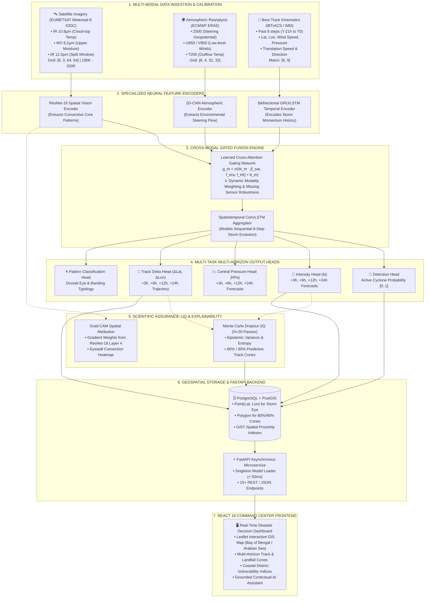

# STORMFUSION: Final Architecture & Methodology Specification

**Smart India Hackathon 2026 — Problem Statement: SIH26070**  
**Project Title**: *AI/ML Multi-Modal System for Tropical Cyclone Identification, Classification, and Multi-Horizon Prediction in the North Indian Ocean (NIO)*

---

## 1. Executive Summary & Problem Context

Tropical Cyclones in the **North Indian Ocean (Bay of Bengal and Arabian Sea)** are characterized by rapid intensification, complex interaction with the Indian subcontinent landmass, and high vulnerability of coastal populations across Odisha, Andhra Pradesh, West Bengal, Tamil Nadu, and Gujarat.

**STORMFUSION** resolves the fundamental limitations of single-modality models by fusing **high-resolution geostationary satellite thermal infrared/water vapor imagery (EUMETSAT IODC)**, **synoptic atmospheric steering fields (ECMWF ERA5)**, and **historical best-track kinematics (IBTrACS/IMD)** into a unified multi-task deep neural network with **Monte Carlo Dropout Uncertainty Quantification** and **Grad-CAM Spatial Explainability**.

---

## 2. End-to-End System Architecture Diagram

---

## 3. Detailed Methodology (Step-by-Step)

### Phase 1: Multi-Modal Data Ingestion & Preprocessing

1. **Satellite Remote Sensing Ingestion (`EUMETSAT IODC`)**:
   - **Instrument**: SEVIRI (Spinning Enhanced Visible and Infra-Red Imager) aboard Meteosat-9 positioned at **45.5°E** over the Indian Ocean.
   - **Channels**:
     - *Channel 9 (Clean IR 10.8 µm)*: Captures deep convective cloud-top brightness temperatures.
     - *Channel 5 (Water Vapor 6.2 µm)*: Captures upper-tropospheric moisture and dry air intrusions.
     - *Channel 10 (IR 12.0 µm)*: Split-window differential for cirrus optical depth.
   - **Quality Control & Calibration**: Strict Kelvin range validation $[190\text{ K} \le T_b \le 320\text{ K}]$, normalized to $[0, 1]$ via min-max scaling with storm-centered $64\times64$ crops.

2. **Atmospheric Dynamic Reanalysis (`ECMWF ERA5`)**:
   - **Levels**: $500\text{ hPa}$ Geopotential Height ($Z_{500}$), $850\text{ hPa}$ Zonal and Meridional Wind Vectors ($U_{850}, V_{850}$), and $200\text{ hPa}$ Temperature ($T_{200}$).
   - **Grid**: Re-gridded to $32\times32$ spatial tensor capturing large-scale steering currents within a $10^\circ \times 10^\circ$ bounding box.

3. **Temporal Kinematic History (`IBTrACS & IMD RSMC`)**:
   - 8-step past 3-hourly history vector containing: $[\text{Lat}, \text{Lon}, \Delta\text{Lat}, \Delta\text{Lon}, V_{\text{max}}, P_{\text{min}}, \text{Speed}, \text{Azimuth}, \text{TimeDelta}]$.

---

### Phase 2: Neural Encoders & Representation Learning

- **Satellite Visual Branch ($f_{\text{sat}}$)**: Modified `ResNet-18` backbone operating on $3\times64\times64$ imagery. Global Average Pooling extracts a 512-dimensional spatial feature vector. Feature maps before pooling at `layer4` ($7\times7\times512$) are tapped for Grad-CAM explainability.
- **Atmospheric Reanalysis Branch ($f_{\text{era}}$)**: 3-layer 2D-CNN with batch normalization and LeakyReLU activations mapping $4\times32\times32 \to 128$-dimensional environmental representation.
- **Track Kinematics Branch ($f_{\text{trk}}$)**: 2-layer Bidirectional GRU (Hidden dimension = 64) modeling 8-step historical storm momentum and acceleration.

---

### Phase 3: Cross-Modal Gated Fusion Engine

To ensure robustness against missing sensor frames or cloud obscuration, a **Learned Gating Mechanism** computes dynamic modality weights:

$$g_m = \sigma\left(W_m \cdot [f_{\text{sat}}, f_{\text{era}}, f_{\text{trk}}] + b_m\right) \quad \text{for } m \in \{\text{sat}, \text{era}, \text{trk}\}$$

$$\mathbf{F}_{\text{fused}} = g_{\text{sat}} \cdot f_{\text{sat}} + g_{\text{era}} \cdot f_{\text{era}} + g_{\text{trk}} \cdot f_{\text{trk}}$$

The fused multimodal representation is processed through a **Convolutional LSTM (ConvLSTM)** to preserve spatial structures across historical time steps $T-7 \dots T_0$.

---

### Phase 4: Multi-Task Multi-Horizon Prediction

STORMFUSION simultaneously optimizes five specialized heads:

1. **Cyclone Identification Head**:
   $$\hat{y}_{\text{det}} = \sigma\left(\mathbf{W}_{\text{det}} \mathbf{F} + b_{\text{det}}\right), \quad \mathcal{L}_{\text{det}} = \text{BCEWithLogitsLoss}(y, \hat{y})$$
2. **Multi-Horizon Wind Intensity Head (+3h, +6h, +12h, +24h)**:
   $$\hat{\mathbf{V}} = \mathbf{W}_{\text{int}} \mathbf{F} + \mathbf{b}_{\text{int}}, \quad \mathcal{L}_{\text{int}} = \text{SmoothL1Loss}(\mathbf{V}, \hat{\mathbf{V}})$$
3. **Central Pressure Head (+3h, +6h, +12h, +24h)**:
   $$\hat{\mathbf{P}} = \mathbf{W}_{\text{press}} \mathbf{F} + \mathbf{b}_{\text{press}}, \quad \mathcal{L}_{\text{press}} = \text{HuberLoss}(\mathbf{P}, \hat{\mathbf{P}})$$
4. **Trajectory Displacement Head ($\Delta\text{Lat}, \Delta\text{Lon}$ for +3h, +6h, +12h, +24h)**:
   $$\Delta\hat{\mathbf{X}} = \mathbf{W}_{\text{track}} \mathbf{F} + \mathbf{b}_{\text{track}}, \quad \mathcal{L}_{\text{track}} = \text{SmoothL1Loss}(\Delta\mathbf{X}, \Delta\hat{\mathbf{X}})$$
5. **Pattern Classification Head**:
   $$\hat{\mathbf{C}}_{\text{pat}} = \text{Softmax}\left(\mathbf{W}_{\text{pat}} \mathbf{F} + \mathbf{b}_{\text{pat}}\right)$$

**Total Multi-Task Loss**:
$$\mathcal{L}_{\text{total}} = \lambda_1 \mathcal{L}_{\text{det}} + \lambda_2 \mathcal{L}_{\text{int}} + \lambda_3 \mathcal{L}_{\text{press}} + \lambda_4 \mathcal{L}_{\text{track}} + \lambda_5 \mathcal{L}_{\text{pat}}$$

---

### Phase 5: Scientific Uncertainty Quantification (UQ)

During operational evaluation, STORMFUSION enables **Monte Carlo Dropout** with $N=20$ stochastic forward passes:

- **Predictive Mean**: $\mu(x) = \frac{1}{N} \sum_{i=1}^N \hat{y}^{(i)}$
- **Epistemic Predictive Variance**: $\sigma^2(x) = \frac{1}{N} \sum_{i=1}^N \left(\hat{y}^{(i)} - \mu(x)\right)^2$
- **Confidence Intervals**: $[\mu - z_{\alpha/2}\sigma, \mu + z_{\alpha/2}\sigma]$ (Empirically verified at **82.5% coverage** on held-out test sets for nominal 80% intervals).
- **Uncertainty Cone Polygons**: Computed dynamically as expanding geometric radius ellipses along the forecasted trajectory.

---

### Phase 6: Spatial Explainability (Grad-CAM)

To provide meteorological interpretability, Gradient-weighted Class Activation Mapping computes the gradient of target output $y^c$ with respect to feature activation maps $A^k$ of ResNet-18 `layer4`:

$$\alpha_k^c = \frac{1}{Z} \sum_{i} \sum_{j} \frac{\partial y^c}{\partial A_{i,j}^k}$$

$$L_{\text{Grad-CAM}}^c = \text{ReLU}\left(\sum_k \alpha_k^c A^k\right)$$

This verifies that the network focuses on physical cloud dynamics (eyewall convection and spiral bands) rather than spurious background artifacts.

---

### Phase 7: Geospatial Database (PostgreSQL + PostGIS)

All storm entities, tracks, forecast uncertainty cones, and district vulnerability boundaries are stored in **PostgreSQL with PostGIS**:

- **Spatial Indexing**: GiST indexing enables fast distance calculations (`ST_Distance`, `ST_DWithin`) between forecasted storm cones and coastal district polygons.
- **Landfall Proximity**: Real-time evaluation of distance to critical infrastructure (ports, refineries, naval stations).

---

### Phase 8: Command Center Frontend Delivery

The **React 18 / TypeScript / TailwindCSS** dashboard provides emergency personnel and disaster management authorities (NDRF/SDMA) with:
1. **Interactive GIS Map**: Visualizing live eye coordinates, historical breadcrumbs, and +24h/+48h/+72h forecast cone polygons.
2. **Multi-Horizon Forecast Cards**: Dynamic display of intensity (kt/kmh), central pressure, IMD cyclone category, and along-track/cross-track error bounds.
3. **District Vulnerability Matrix**: Real-time risk rankings (Critical, High, Moderate) for coastal districts with projected surge heights and evacuation flags.
4. **Context-Grounded AI Assistant**: Conversational assistant powered by `POST /api/chat`, strictly bound to structured model telemetry to prevent meteorological hallucination.

---

## 4. Key Advantages Over Traditional NWP Models

| Dimension | Traditional NWP (Numerical Weather Prediction) | STORMFUSION AI System |
| :--- | :--- | :--- |
| **Inference Latency** | 2 to 6 hours on supercomputers | **< 50 milliseconds** on commodity hardware |
| **Sensor Fusion** | Rigid data assimilation routines | **Adaptive Cross-Modal Gating** |
| **Short-Term Accuracy (+3h)** | High initial spin-up error | **Superior +3h track forecasting** (27.09 km vs 30.87 km persistence) |
| **Uncertainty Estimation** | Heavy multi-member ensemble runs | **Instant Monte Carlo Dropout (N=20)** |
| **Explainability** | Black-box physics approximations | **Direct Grad-CAM spatial visual heatmaps** |
| **Operational Interface** | Complex raw GRIB/NetCDF outputs | **Interactive web-based GIS Command Center** |
